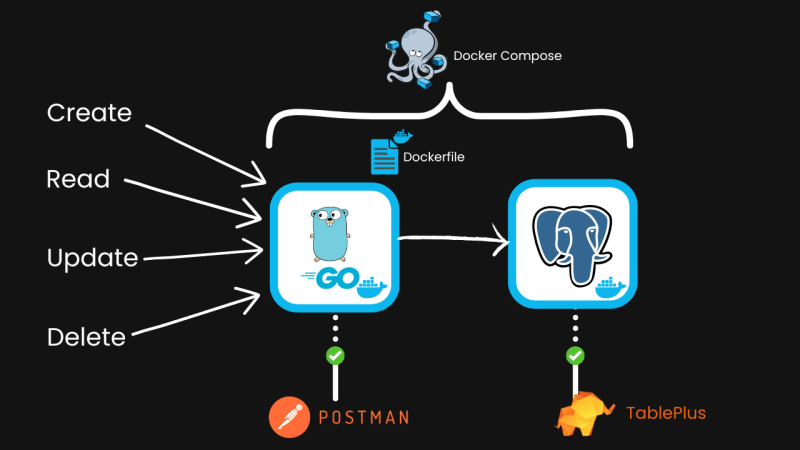

# CRUD Application with Go, PostgreSQL, Docker, and Gorilla Mux

This is a simple CRUD (Create, Read, Update, Delete) application built with Go, PostgreSQL, Docker, and the Gorilla Mux router. The application allows you to manage user data in a PostgreSQL database.

## Prerequisites

- [Go](https://golang.org/dl/) (version 1.16 or higher)
- [Docker](https://www.docker.com/get-started)
- [Docker Compose](https://docs.docker.com/compose/install/)
- [PostgreSQL](https://www.postgresql.org/download/)

## Project Structure

.
├── Dockerfile
├── docker-compose.yml
├── go.mod
├── go.sum
├── main.go
└── README.md